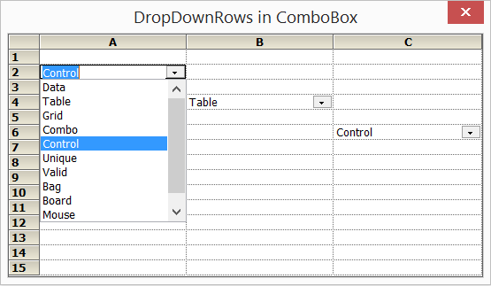

# How-to-control-the-number-of-visible-items-in-a-ComboBox-cell-in-WinForms-GridControl
In order to control the items showing in dropdown of combo box, GridComboBoxListBoxPart.DropDownRows property can be used. The GridComboBoxListBoxPart is the actual control type of the list that is dropped to display the items. But it is buried a little deep and generally needs an event handler to set it in [WinForms GridControl](https://www.syncfusion.com/winforms-ui-controls/grid-control).

The reason for using an event handler is that normally a single ComboBox control is shared among all ComboBox cells. Each cell can potentially have a different list and may need different numbers of visible rows. So, to handle this, you must catch Grid.CurrentCellShowingDropDown event and set the property there depending upon the exact row and column.

**C#**

```
gridControl1.CurrentCellShowingDropDown += OnCurrentCellShowingDropDown;

void OnCurrentCellShowingDropDown(object sender, GridCurrentCellShowingDropDownEventArgs e)
{
    GridControlBase grid = sender as GridControlBase;
    if (grid != null)
    {
        GridCurrentCell cc = grid.CurrentCell;
        GridComboBoxCellRenderer cr = cc.Renderer as GridComboBoxCellRenderer;

        //Sets number of visible items for comboboxes in Row 6 as 4, Row 4 as 7, Row 2 as 10 , and so on. 

        if (cc != null)
        {
            if (cc.RowIndex == 6)
                ((GridComboBoxListBoxPart)cr.ListBoxPart).DropDownRows = 4;
            else if (cc.RowIndex == 4)
                ((GridComboBoxListBoxPart)cr.ListBoxPart).DropDownRows = 7;
            else if (cc.RowIndex == 2)
                ((GridComboBoxListBoxPart)cr.ListBoxPart).DropDownRows = 10;
            else ((GridComboBoxListBoxPart)cr.ListBoxPart).DropDownRows = 6;
        }
    }
}
```

**VB**

```
AddHandler gridControl1.CurrentCellShowingDropDown, AddressOf OnCurrentCellShowingDropDown

Private Sub OnCurrentCellShowingDropDown(sender As Object, e As GridCurrentCellShowingDropDownEventArgs)
    Dim grid As GridControlBase = TryCast(sender, GridControlBase)
    If grid IsNot Nothing Then
        Dim cc As GridCurrentCell = grid.CurrentCell
        Dim cr As GridComboBoxCellRenderer = TryCast(cc.Renderer, GridComboBoxCellRenderer)

        If cc IsNot Nothing AndAlso cr IsNot Nothing Then
            Dim listBoxPart As GridComboBoxListBoxPart = CType(cr.ListBoxPart, GridComboBoxListBoxPart)

            ' Sets number of visible items for comboboxes in Row 6 as 4, Row 4 as 7, Row 2 as 10 , and so on.
            Select Case cc.RowIndex
                Case 6
                    listBoxPart.DropDownRows = 4
                Case 4
                    listBoxPart.DropDownRows = 7
                Case 2
                    listBoxPart.DropDownRows = 10
                Case Else
                    listBoxPart.DropDownRows = 6
            End Select
        End If
    End If
End Sub
``` 


